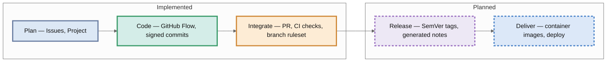

# ProjetoTAG

A reusable Kubernetes platform for microservices, built and operated by a single developer as a learning-driven, contract-first project.

## What this repository contains

This repository holds the public, versioned artifacts of the platform:

- `cluster/` — local cluster definition (Kind) *(planned)*
- `platform/` — platform components: networking, ingress, certificates, secrets, data, messaging, identity, API gateway and observability *(planned)*
- `apps/` — workload manifests for each microservice consuming the platform *(planned)*
- `secrets/sealed/` — encrypted secrets, safe to version *(planned)*
- `adr/` — public summaries of architectural decisions that materialize in public artifacts *(planned)*

The platform is currently in its design and validation phase; implementation artifacts land here incrementally, starting with the repository's own CI.

## How changes flow

End-to-end view of the delivery process. Each color marks a stage; a solid outline means implemented today, dashed means planned.

Across every stage: dependency pins kept current automatically, secret scanning with push protection, and least-privilege workflow permissions.

## Approach

- **Contract-first:** every component is specified and validated against official documentation before anything is implemented.
- **Declarative only:** all state is versioned; nothing is created imperatively.
- **Proportionality:** one maintainer, local-first — the simplest solution that fully satisfies current and foreseeable requirements.

## License

Licensed under the [PolyForm Noncommercial License 1.0.0](LICENSE) — noncommercial use only.

Required Notice: Copyright (c) Tiago Arruda Gayer (<https://github.com/tiagogayer/ProjetoTAG>)
